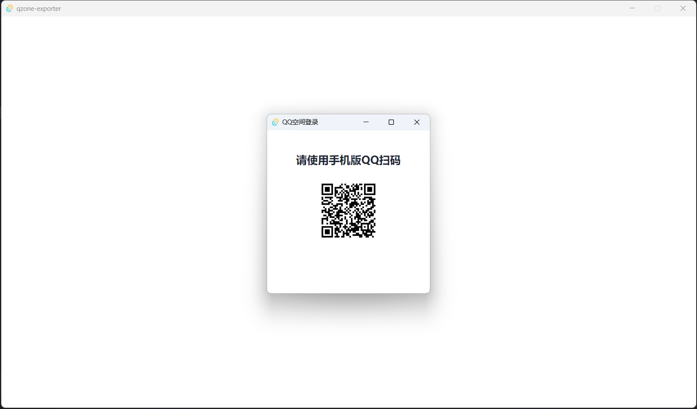

# qzone-exporter

## 简介

QQ空间相册导出工具

## 技术栈
- Rust
- TypeScript
- Tauri 
- Vue 3
- daisyUI

# 开发

- 安装[NodeJs](https://nodejs.org/en)/[Rust](https://www.rust-lang.org/learn/get-started)
- 拉取代码:`git clone https://github.com/ClassmateLin/qzone-exporter.git`
- 安装依赖:`cd qzone-exporter && npm install`
- 运行开发模式: `npm run tauri dev`

## 功能列表

- [x] 扫码登录

## 项目展示

- 扫码登录: 

